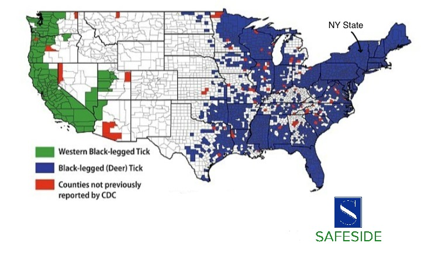

```{r setup, include=FALSE}
library("HDInterval")
library("invgamma")
library("tibble")
library("tidyr")
library("dplyr")
library("ggplot2")
library("patchwork")
library("knitr")
library("tables")
library("reactable")
```
# Sledovanie aktivity nýmf kliešťov čiernonohých

Tento projekt je zameraný na analýzu aktivity nýmf kliešťov čiernonohých v zmysle ich výskytu v skúmaných oblastiach. \

## Motivácia

Kliešťe čiernonohé sa vyskytujú zväčša na východnom pobreží USA a v juhovýchodnej Kanade. Tento druh je prenášačom viacerých ochorení ako napríklad lymská borelióza, babezióza, Powassanova vírusová choroba a ďalšie. Aj keď štádium nymfy má nižšiu mieru infikovanosti ako dospelí jedinci, kvôli ich malej veľkosti je ich prítomnosť ťažšie zistiť. Toto životné štádium je kvôli tomu v najväčšej miere prenášačom patogénov z kliešťov na ľudí. \
Hlavným cieľom je teda zvýšiť povedomie o rizikách spojených s kontaktom s kliešťami a chorobami, ktoré môžu prenášať.

## Dataset

Použité dáta sú dostupné na:  https://health.data.ny.gov/Health/Deer-Tick-Surveillance-Nymphs-May-to-Sept-excludin/kibp-u2ip/data. \

Dataset obsahuje údaje o zbere a testovaní nýmf kliešťov čiernonohých v priebehu 15-tich rokov (od roku 2008 až 2022) vždy v mesiacoch máj až september, v štáte New York. Štát New York sa skladá z 62 krajov (autonómnych oblastí). Zber sa konal na rôznych miestach vo vybraných krajoch s výnimkou mesta New York, pričom sa ich výber aj počet v priebehu rokov líšil. Skúmané oblasti boli vybrané na základe niekoľkých faktorov — zámerom bolo vybrať také miesta, kde môže verejnosť tráviť čas na turistike, poľovačke alebo v kempe. Kliešte sa zachytávali tak, že sa dostali do kontaktu s kusom látky, ktorý bol ťahaný po zemi a po okolitej vegetácii.

<div style="text-align:center;">
```{r include_image, echo=FALSE, out.width='65%'}

```
</div>
<p style="text-align:center;">Mapa USA. Potvrdený výskyt kliešťa čiernonohého je znázornený modrou farbou. \
Zdroj: https://www.safesidetreatments.com/news/2020/3/8/us-tick-map.</p>

```{r}

```
## Exploračná Analýza

Kompletný dataset obsahuje údaje o počte aj infikovanosti kliešťov baktériami, odchytených na presnom mieste a v istom roku.
```{r}
data <- read.csv2(file = "dataset/deer_tick_surveillance.csv", sep=",")
glimpse(data)

colnames(data)[colnames(data) == "Total.Ticks.Collected"] ="y"
colnames(data)[colnames(data) == "Total.Sites.Visited"] = "n"

data <- data |> mutate(rok = as.factor(Year)) |> select(rok, y, n)
data$MLE <- data$y / data$n
```
\
Tento projekt pracuje iba s údajmi o počte odchytených kliešťov a počte skúmaných oblastí v priebehu rokov. \
Následujúca prehľadová tabuľka obsahuje celkové počty pozorovaní **y** v **n** skúmaných oblastiach pre každý rok, ako aj základné číselné charakteristiky pre jednotlivé **y** a klasický frekventistický **ML** odhad.

```{r results='asis', warning=FALSE}

dat <- data |> mutate(y_tmp = y) |> group_by(rok) |> 
  summarize(y = sum(y_tmp),
            n = sum(n),
            MLE = y / n,
            min_y = min(y_tmp),
            q1_y = quantile(y_tmp, probs =0.25),
            median = median(y_tmp),
            mean = mean(y_tmp),
            q3_y = quantile(y_tmp, probs =0.75),
            max_y = max(y_tmp)
  )

reactable(
  dat,
  resizable = TRUE,
  compact = TRUE,
  columns = list(
    MLE = colDef(format = colFormat(digits = 3)),
    mean = colDef(name = "mean(y)", format = colFormat(digits = 3)),
    min_y = colDef(name = "min(y)"),
    max_y = colDef(name = "max(y)"),
    q1_y = colDef(name = "1st Qu.(y)"),
    q3_y = colDef(name = "3rd Qu.(y)"),
    median = colDef(name = "median(y)")
  ),
  defaultColDef = colDef(width = 80, align = "center"),
  defaultPageSize = 15,
  theme = reactableTheme(
    style = list(fontFamily = "-system-ui, -apple-system, BlinkMacSystemFont, Segoe UI, Helvetica, Arial, sans-serif", ".reactable-container" = list(width = "auto"))
  )
)
```
\
Z tabuľky a grafu nižšie vidieť meniaci sa trend v počte odchytených kliešťov. Zatiaľ čo ich (frekventistický) odhadovaný počet pre jednu oblasť medzi rokmi 2008 až 2016 bol klesajúci, po roku 2016 je naopak prevažne rastúci. 
```{r}
dat |> ggplot(aes(y = y / n, x = rok, fill = rok)) + 
  geom_jitter(pch = 21, size = 2.5, width = 0, height = 0.1) + 
  labs(title="Bodový graf ML odhadu počtu kliešťov pre jednu oblasť", x = "Rok", y = "MLE") +
  guides(fill = 'none')
```
\
Z boxplotov môžeme pozorovať, že v druhej polovici skúmaného obdobia (približne po roku 2015) stúpol počet záznamov s mimoriadne vysokou aktivitou kliešťov.
```{r, warning=FALSE}
data |> select(rok, y) |>
  ggplot(aes(y = rok, x = y, fill = rok)) + 
  geom_boxplot(color = "black", alpha = 0.3, outlier.shape = NA) + 
  geom_jitter(pch = 21, size = 2.5, width = 0, height = 0.1) + 
  labs(title="Boxploty počtu kliešťov v priebehu rokov", x = "Počet kliešťov y", y = "Rok")+
  guides(fill = 'none')

data |> select(rok, y) |>
  ggplot(aes(y = rok, x = y, fill = rok)) + 
  geom_boxplot(color = "black", alpha = 0.3, outlier.shape = NA) + 
  geom_jitter(pch = 21, size = 2.5, width = 0, height = 0.1) + 
  xlim(0, 700) +
  labs(title="Boxploty počtu kliešťov v priebehu rokov — detail", x = "Počet kliešťov y", y = "Rok")+
  guides(fill = 'none')
```
\
Rozsah výberu **n** počas daného obdobia však nebol konzistentný. Novšie záznamy prevažne obsahujú dáta s väčším rozsahom výberu.
```{r}
ggplot(dat, aes(x = rok, y = n, fill = rok)) +
  geom_bar(stat = "identity", color = "black", fill = "cornflowerblue") +
  labs(title = "Histogram počtu skúmaných oblastí v priebehu rokov", x = "Rok", y = "Počet skúmaných oblastí n")
```
```{r}
dat |> ggplot(aes(y = y / n, x = n, fill=rok)) + 
  geom_jitter(pch = 21, size = 2.5, width = 0, height = 0.1) + 
  labs(title="Bodový graf ML odhadu počtu kliešťov pre 1 oblasť vzhľadom k rozsahu n", x = "Počet navštívených oblastí n", y = "MLE")
```
```{r}

```
## Bayesovská Analýza
Cieľom je preskúmať, ako sa v priebehu rokov mení aktivita kliešťov v štáte New York, t.j. modelovať očakávaný počet kliešťov $\theta$, s využitím Bayesovského prístupu.
```{r}

```
### Poissonov Model

Predpokladáme, že výskyt kliešťov v skúmaných oblastiach sa riadi Poissonovým rozdelením pravdepodobnosti. \
Pozorujeme teda náhodné výbery $(Y_1, ..., Y_n)$ z Poissonovho rozdelenia $(Y_k | \theta)$~$Po(\theta)$, $k=1, ..., n$. \
Postačujúcou štatistikou je v tomto prípade celkový počet pozorovaní za rok $Y=\sum\limits_{k=1}^{n}Y_k$ s rozdelením $(Y|\theta)$~$Po(n\theta)$. \
Obrázok nižšie zobrazuje vierohodnostné funkcie $f(y|\theta)\propto L(\theta;y)=(n\theta)^y e^{-n\theta}$ pre jednotlivé roky. 
```{r, warning=FALSE}
d.l <- data.frame(theta = seq(0, 140, by = 0.1)) |> 
  cross_join(dat) |> 
  mutate(
    likelihood = dpois(dat$y, dat$n * theta)
    )

d.l |> 
  ggplot(aes(x = theta, y = likelihood, color = rok, fill=rok)) + 
  geom_line(linewidth = 0.6) + 
  labs(x = expression(paste("Stredný počet kliešťov ", theta)), y = expression(paste("Vierohodnostná funkcia ", L(theta)))) + 
  xlim(25, 140)
```
\
Budeme pracovať s pozorovaniami z rokov 2010, 2016 a 2022, teda s meraniami s odstupom šiestich rokov. \
Tieto skupiny budeme modelovať zvlášť a výsledky následne porovnáme. \
```{r, warning=FALSE}
reactable(
  dat |> filter(rok == 2010 | rok == 2016 | rok == 2022),
  resizable = TRUE,
  compact = TRUE,
  columns = list(
    MLE = colDef(format = colFormat(digits = 3)),
    mean = colDef(name = "mean(y)", format = colFormat(digits = 3)),
    q1_y = colDef(name = "1st Qu.(y)"),
    q3_y = colDef(name = "3rd Qu.(y)"),
    min_y = colDef(name = "min(y)"),
    max_y = colDef(name = "max(y)"),
    median = colDef(name = "median(y)")
  ),
  defaultColDef = colDef(width = 80, align = "center"),
  defaultPageSize = 15,
  theme = reactableTheme(
    style = list(fontFamily = "-system-ui, -apple-system, BlinkMacSystemFont, Segoe UI, Helvetica, Arial, sans-serif", ".reactable-container" = list(width = "auto"))
  )
)
```
```{r, warning=FALSE}
plot1 <- dat |> filter(rok == 2010 | rok == 2016 | rok == 2022)|> 
  ggplot(aes(y = y / n, x = rok, fill = rok)) + 
  geom_jitter(pch = 21, size = 2.5, width = 0, height = 0.1) + 
  labs(x = "Rok", y = "MLE")+
  guides(fill = FALSE)

plot2 <- dat |> filter(rok == 2010 | rok == 2016 | rok == 2022)|> 
  ggplot(aes(y = y / n, x = n, fill = rok)) + 
  geom_jitter(pch = 21, size = 2.5, width = 0, height = 0.1) + 
  labs(x = "Počet navštívených oblastí n", y = "MLE")

plot3 <- data |> filter(rok == 2010 | rok == 2016 | rok == 2022)|> 
  ggplot(aes(y = rok, x = y, fill = rok)) + 
  geom_boxplot(color = "black", alpha = 0.3, outlier.shape = NA) + 
  geom_jitter(pch = 21, size = 2.5, width = 0, height = 0.1) + 
  xlim(0, 550) +
  labs(title="Boxploty počtu kliešťov v jednotlivých skupinách — detail", x = "Počet kliešťov y", y = "Rok")+
  guides(fill = FALSE)

(plot1 + plot2) / plot3
```
```{r}
n1 <- dat |> filter(rok == 2010) |> pull(n)
n2 <- dat |> filter(rok == 2016) |> pull(n)
n3 <- dat |> filter(rok == 2022) |> pull(n)

y1 <- dat |> filter(rok == 2010) |> pull(y)
y2 <- dat |> filter(rok == 2016) |> pull(y)
y3 <- dat |> filter(rok == 2022) |> pull(y)
```
```{r}

```
#### Apriorne a Aposteriorne Rozdelenia
Vzhľadom na to, že nemáme ďalšie dodatočné informácie o parametri $\theta$, nie je žiaduce aposteriorne výsledky výrazne regularizovať. Skúsime dve voľby apriorneho rozdelenia — slabo informatívne a neinformatívne. \

V Poissonovom modeli konjugovaný systém apriornych hustôt tvorí hustoty Gama rozdelenia. \
Apriorne rozdelenie je teda $\Theta$~$Gama(a,b)$, kde $a$ reprezentuje celkový počet udalostí vo fiktívnom apriornom výbere a $b$ je rozsah fiktívneho apriorneho výberu (tzv. degree of belief).
Pre strednú hodnotu a rozptyl platia vzťahy $E(\Theta)=\frac{a}{b}$, $Var(\Theta)=\frac{a}{b^2}$. \
Aposteriorne rozdelenie je opäť Gama $(\Theta|Y=y)$~$Gama(a+y, b+n)$ s číselnými charakteristikami $E(\Theta|Y=y)=\frac{a+y}{b+n}$, $Var(\Theta|Y=y)=\frac{a+y}{(b+n)^2}$. \

##### Slabo Informatívne Apriórne Rozdelenie

Pri prvej voľbe parametrov apriorneho rozdelenia využijeme informáciu o celkovom priemernom počte odchytených kliešťov pre jednu oblasť v priebehu celej dĺžky štúdie, t.j. od roku 2008 do 2022 \
\[
\bar{y}=(\frac{y_{2008}}{n_{2008}} + \frac{y_{2009}}{n_{2009}}+...+\frac{y_{2022}}{n_{2022}})/(2022-2008+1)=88.42881\approx_{}88
\]
Parametre $a$, $b$ chceme teda zvoliť tak, aby $E(\Theta)\approx_{}88$ a rozptyl bol veľký, teda váhu ponecháme hlavne dátam z experimentu v jednotlivých skupinách. Použijeme hodnoty $b=0.041$, $a=\bar{y}b\approx_{}3.63$. \

Grafy nižšie zobrazujú vierohodnosť, apriornu a aposteriorne hustoty pre jednotlivé skupiny rokov. 
```{r}
est <- round(dat |> summarize(s = sum(MLE)) |> pull(s) / nrow(dat))

b <- 0.041
a <- est * b
theta <- seq(0, 150, by = 0.1)

d.prior <- data.frame(theta = theta) |> 
  mutate(
    n = NA, 
    y = NA, 
    p = dgamma(theta, a, b), 
    model = "prior"
    )

d.posterior1 <- data.frame(n = n1, y = y1, theta = theta) |> 
  mutate(
    p = dgamma(theta, a + y, b + n), 
    model = "posterior 2010"
    )

d.posterior2 <- data.frame(n = n2, y = y2, theta = theta) |> 
  mutate(
    p = 0.2 * dgamma(theta, a + y, b + n), 
    model = "posterior 2016"
    )

d.posterior3 <- data.frame(n = n3, y = y3, theta = theta) |> 
  mutate(
    p = 0.5 * dgamma(theta, a + y, b + n), 
    model = "posterior 2022"
    )

d.likelihood1 <- tibble(
    theta = theta,
    model = "likelihood 2010",
    n = n1,
    y = y1
  ) |> mutate(p = 5 * dpois(y, n * theta))

d.likelihood2 <- tibble(
    theta = theta,
    model = "likelihood 2016",
    n = n2,
    y = y2
  ) |> mutate(p = 10 * dpois(y, n * theta))

d.likelihood3 <- tibble(
    theta = theta,
    model = "likelihood 2022",
    n = n3,
    y = y3
  ) |> mutate(p = 15 * dpois(y, n * theta))
```
```{r}
d.likelihood <- bind_rows(d.likelihood1, d.likelihood2, d.likelihood3) 
d.posterior <- bind_rows(d.posterior1, d.posterior2, d.posterior3)

d.prior |> bind_rows(d.posterior, d.likelihood) |> 
  mutate(type = factor(model, levels = c("prior", "posterior 2010", "posterior 2016", "posterior 2022", "likelihood 2010", "likelihood 2016", "likelihood 2022"))) |>
  ggplot(aes(x = theta, y = p, color = type, fill = type)) + 
  geom_line(linewidth = 0.8) +   
  labs(x = expression(paste("Stredný počet kliešťov ", theta)), y = "Hustota")
```
```{r, warning=FALSE}
plot1 <- d.prior |> bind_rows(d.posterior1, d.likelihood1) |> 
  mutate(type = factor(model, levels = c("prior", "posterior 2010", "likelihood 2010"))) |>
  ggplot(aes(x = theta, y = p, color = type, fill = type)) + 
  geom_line(linewidth = 0.8) + 
  xlim(75, 95) +
  labs(x = NULL, y = NULL)

plot2 <- d.prior |> bind_rows(d.posterior2, d.likelihood2) |> 
  mutate(type = factor(model, levels = c("prior", "posterior 2016", "likelihood 2016"))) |>
  ggplot(aes(x = theta, y = p, color = type, fill = type)) + 
  geom_line(linewidth = 0.8) + 
  xlim(20, 40) +
  labs(x = NULL, y = "Hustota")

plot3 <- d.prior |> bind_rows(d.posterior3, d.likelihood3) |> 
  mutate(type = factor(model, levels = c("prior", "posterior 2022", "likelihood 2022"))) |>
  ggplot(aes(x = theta, y = p, color = type, fill = type)) + 
  geom_line(linewidth = 0.8) + 
  xlim(120, 140) +
  labs(x = expression(paste("Stredný počet kliešťov ", theta)), y = NULL)

plot1 / plot2 / plot3
```
\
Tabuľka nižšie uvádza základné číselné charakteristiky aposteriorných rozdelení. Keďže hustota $p(\theta|y)$ je unimodálna, MAP odhad je rovný modusu $\hat{\theta}_{MAP}=Mode(\Theta|Y=y)=\frac{a+y-1}{b+n}$. \

Môžeme vidieť, že stredné hodnoty sa výrazne odlišujú a 95%-né kredibilné intervaly aposteriornych rozdelení sú neprekrývajúce sa. Medzi rokmi 2010 a 2016 je najprv badať prepad a následne v 2022 výrazný nárast v strednom počte kliešťov na jednu oblasť. Smerodajné odchýlky (a teda aj rozptyly) sa medzi skupinami taktiež badateľne líšia, najužšia je pre záznam z roku 2016. Zároveň v exploračnej analýze v predchádzajúcej časti sa dá pozorovať, že spomedzi vybraných troch skupín najviac preskúmaných oblastí bolo práve v roku 2016.

```{r}
prior <- list(a = a, b = b)
posterior1 <- list(a = a + y1, b = b + n1, y = y1, n = n1)
posterior2 <- list(a = a + y2, b = b + n2, y = y2, n = n2)
posterior3 <- list(a = a + y3, b = b + n3, y = y3, n = n3)

stat.prior <- with(prior, data.frame(
    model = "prior", 
    MAP = NA,
    mean = a / b, 
    sd = sqrt(a / b^2), 
    ETCI.lower = qgamma(0.025, a, b),
    ETCI.upper = qgamma(0.975, a, b),
    HPD = t(hdi(qgamma, credMass = 0.95, shape = a, rate = b))
    ))

stat.posterior1 <- with(posterior1, data.frame(
    model = "posterior 2010", 
    MAP = (a-1)/b,
    mean = a/b,
    sd = sqrt(a/b^2), 
    ETCI.lower = qgamma(0.025, a, b), 
    ETCI.upper = qgamma(0.975, a, b),
    HPD = t(hdi(qgamma, credMass = 0.95, shape = a, rate = b))
    ))
stat.posterior2 <- with(posterior2, data.frame(
    model = "posterior 2016",
    MAP = (a-1)/b,
    mean = a/b,
    sd = sqrt(a/b^2), 
    ETCI.lower = qgamma(0.025, a, b), 
    ETCI.upper = qgamma(0.975, a, b),
    HPD = t(hdi(qgamma, credMass = 0.95, shape = a, rate = b))
    ))
stat.posterior3 <- with(posterior3, data.frame(
    model = "posterior 2022",
    MAP = (a-1)/b,
    mean = a/b,
    sd = sqrt(a/b^2), 
    ETCI.lower = qgamma(0.025, a, b), 
    ETCI.upper = qgamma(0.975, a, b),
    HPD = t(hdi(qgamma, credMass = 0.95, shape = a, rate = b))
    ))
reactable(rbind(stat.prior, stat.posterior1, stat.posterior2, stat.posterior3),
          resizable = TRUE,
          compact = TRUE,
          columns = list(
                    MLE = colDef(format = colFormat(digits = 3)),
                    MAP = colDef(format = colFormat(digits = 3)),
                    mean = colDef(format = colFormat(digits = 3)),
                    sd = colDef(format = colFormat(digits = 3)),
                    ETCI.lower = colDef(format = colFormat(digits = 3)),
                    ETCI.upper = colDef(format = colFormat(digits = 3)),
                    HPD.lower = colDef(format = colFormat(digits = 3)),
                    HPD.upper = colDef(format = colFormat(digits = 3))
          ),
          defaultColDef = colDef(width = 90, align = "center"),
          defaultPageSize = 15,
          theme = reactableTheme(
                     style = list(fontFamily = "-system-ui, -apple-system, BlinkMacSystemFont, Segoe UI, Helvetica, Arial, sans-serif", ".reactable-container" = list(width = "auto"))
          ))
```
```{r}

```
##### Prediktívne rozdelenie

Aposteriorne prediktívne rozdelenie pre nový výsledok, t.j. pre novú skúmanú oblasť, má negatívne binomické rozdelenie $(Y^*_{n+1}|Y=y)$~$NBi(a+y, \frac{b+n}{b+n+1})$ s charakterisitkami $E(Y^*_{n+1}|Y=y)=\frac{a+y}{b+n}$, $Var(Y^*_{n+1}|Y=y)=\frac{(a+y)(b+n+1)}{(b+n)^2}$.

```{r, warning=FALSE, include=FALSE}
d.posterior1pred <- tibble(
    y.pred = seq(55, 115, by = 0.1),
    f = dnbinom(y.pred, size = a + y1, prob = (b + n1)/(b + n1 + 1)),
    model = "posterior 2010"
)

d.posterior2pred <- tibble(
    y.pred = seq(12,48, by = 0.001),
    f = dnbinom(y.pred, size = a + y2, prob = (b + n2)/(b + n2 + 1)),
    model = "posterior 2016"
)

d.posterior3pred <- tibble(
    y.pred = seq(95, 165, by = 0.1),
    f = dnbinom(y.pred, size = a + y3, prob = (b + n3)/(b + n3 + 1)),
    model = "posterior 2022"
)

plot1 <- d.posterior1pred |> ggplot(aes(x = y.pred, y = f, group = model, colour = model)) + 
  geom_line(linewidth = 0.3, lty = 2) + 
  geom_point(size = 0.9, pch = 19) +
  labs(title="Predikovaný počet kliešťov v budúcej skúmanej oblasti", x = NULL, y = NULL)

plot2 <- d.posterior2pred |> ggplot(aes(x = y.pred, y = f, group = model, colour = model)) + 
  geom_line(linewidth = 0.3, lty = 2) + 
  geom_point(size = 1, pch = 19) +
  labs(x = NULL, y = "Prediktívne pravdepod.")

plot3 <- d.posterior3pred |> ggplot(aes(x = y.pred, y = f, group = model, colour = model)) + 
  geom_line(linewidth = 0.3, lty = 2) + 
  geom_point(size = 1, pch = 19) +
  labs(x = expression(paste("Predikovaný počet kliešťov ", y[n+1])), y = NULL)

plot1 / plot2 / plot3
```
```{r, warning=FALSE}
d.prior.pred <- tibble(
    y.pred = seq(0, 175, by = 1),
    f = dnbinom(y.pred, size = a, prob = b /(b + 1)),
    model = "marginal"
    )

d.posterior1pred <- tibble(
    y.pred = seq(0, 175, by = 0.1),
    f = dnbinom(y.pred, size = a + y1, prob = (b + n1)/(b + n1 + 1)),
    model = "posterior 2010"
)

d.posterior2pred <- tibble(
    y.pred = seq(0, 175, by = 0.1),
    f = dnbinom(y.pred, size = a + y2, prob = (b + n2)/(b + n2 + 1)),
    model = "posterior 2016"
)

d.posterior3pred <- tibble(
    y.pred = seq(0, 175, by = 0.1),
    f = dnbinom(y.pred, size = a + y3, prob = (b + n3)/(b + n3 + 1)),
    model = "posterior 2022"
)
pred <- bind_rows(d.prior.pred, d.posterior1pred, d.posterior2pred, d.posterior3pred) 

pred |>
  mutate(type = factor(model, levels = c("marginal", "posterior 2010", "posterior 2016", "posterior 2022"))) |>
  ggplot(aes(x = y.pred, y = f, color = model, fill = model)) + 
  geom_line(linewidth = 0.3, lty = 2) + 
  geom_point(size = 0.7, pch = 19) +
  labs(title="Predikovaný počet kliešťov v budúcej skúmanej oblasti", x = expression(paste("Predikovaný počet kliešťov ", y[n+1])), y = "Prediktívna pravdepodobnosť")
```
\
Tabuľka nižšie udáva odpovedajúce číselné charakteristiky. Smerodajné odchýlky aj intervaly spoľahlivosti sú v prípade prediktívnych rozdelení pre budúci výsledok podľa očakávaní výrazne širšie, avšak v nadväznosti šiestich rokov stále neprekrývajúce sa, teda sa dá zhodnotiť, že rozdiely sú významné.
```{r}
stat.pred.prior <- with(prior, data.frame(
    model = "marginal", 
    mean = a / b, 
    sd = sqrt(a*(b+1)/b^2),
    lower = qnbinom(0.025, a, b / (b+1)),
    upper = qnbinom(0.975, a, b / (b+1))
    ))

stat.pred.posterior1 <- with(posterior1, data.frame(
    model = "posterior 2010", 
    mean = a / b,
    sd = sqrt(a*(b+1)/b^2),
    lower = qnbinom(0.025, a, b / (b+1)), 
    upper = qnbinom(0.975, a, b / (b+1))
    ))
stat.pred.posterior2 <- with(posterior2, data.frame(
    model = "posterior 2016",
    mean = a / b,
    sd = sqrt(a*(b+1)/b^2),
    lower = qnbinom(0.025, a, b / (b+1)), 
    upper = qnbinom(0.975, a, b / (b+1))
    ))
stat.pred.posterior3 <- with(posterior3, data.frame(
    model = "posterior 2022",
    mean = a / b,
    sd = sqrt(a*(b+1)/b^2),
    lower = qnbinom(0.025, a, b / (b+1)), 
    upper = qnbinom(0.975, a, b / (b+1))
    ))
reactable(rbind(stat.pred.prior, stat.pred.posterior1, stat.pred.posterior2, stat.pred.posterior3),
          resizable = TRUE,
          compact = TRUE,
          columns = list(
                    mean = colDef(format = colFormat(digits = 3)),
                    sd = colDef(format = colFormat(digits = 3))
          ),
          defaultColDef = colDef(width = 100, align = "center"),
          defaultPageSize = 15,
          theme = reactableTheme(
                     style = list(fontFamily = "-system-ui, -apple-system, BlinkMacSystemFont, Segoe UI, Helvetica, Arial, sans-serif", ".reactable-container" = list(width = "auto"))
          ))
```
Môžeme modelovať aj aposteriorne prediktívne rozdelenie pre fixný počet $m$ skúmaných oblastí. To má tiež negatívne binomické rozdelenie $(\hat{Y}|Y=y)$~$NBi(a+y, \frac{b+n}{b+n+m})$ s charakterisitkami $E(\hat{Y}|Y=y)=\frac{a+y}{b+n}m$, $Var(\hat{Y}|Y=y)=\frac{(a+y)(b+n+m)}{(b+n)^2}m$. Zvolíme $m=50$. \
V tomto prípade sa rozdiely medzi skupinami ešte zvýraznia.
```{r, warning=FALSE}
m <- 50

d.posterior1pred.fixed <- tibble(
    y.pred = seq(1100, 7000, by = 0.19),  
    f = dnbinom(y.pred, size = a + y1, prob = (b + n1)/(b + n1 + m)),
    model = "posterior 2010"
)

d.posterior2pred.fixed <- tibble(
    y.pred = seq(1100, 7000, by = 0.19),
    f = dnbinom(y.pred, size = a + y2, prob = (b + n2)/(b + n2 + m)),
    model = "posterior 2016"
)

d.posterior3pred.fixed <- tibble(
    y.pred = seq(1100, 7000, by = 0.19),
    f = dnbinom(y.pred, size = a + y3, prob = (b + n3)/(b + n3 + m)),
    model = "posterior 2022"
)

pred <- bind_rows(d.posterior1pred.fixed, d.posterior2pred.fixed, d.posterior3pred.fixed) 

pred |> 
  ggplot(aes(x = y.pred, y = f, group = model, colour = model)) + 
  geom_line(linewidth = 0.3, lty = 2) + 
  geom_point(size = 0.7, pch = 19) +
  labs(title="Predikovaný počet kliešťov pre 50 oblastí", x = expression(paste("Predikovaný počet kliešťov ", hat(y))), y = "Prediktívna pravdepodobnosť")
```
```{r, warning=FALSE, include=FALSE}
d.posterior1pred.fixed <- tibble(
    y.pred = seq(3900, 4650, by = 0.019),  
    f = dnbinom(y.pred, size = a + y1, prob = (b + n1)/(b + n1 + m)),
    model = "posterior 2010"
)

d.posterior2pred.fixed <- tibble(
    y.pred = seq(1350, 1650, by = 0.07),
    f = dnbinom(y.pred, size = a + y2, prob = (b + n2)/(b + n2 + m)),
    model = "posterior 2016"
)

d.posterior3pred.fixed <- tibble(
    y.pred = seq(6200, 6850, by = 0.19),
    f = dnbinom(y.pred, size = a + y3, prob = (b + n3)/(b + n3 + m)),
    model = "posterior 2022"
)

plot1 <- d.posterior1pred.fixed |> ggplot(aes(x = y.pred, y = f, group = model, colour = model)) + 
  geom_line(linewidth = 0.3, lty = 2) + 
  geom_point(size = 0.7, pch = 19) +
  labs(title="Predikovaný počet kliešťov pre 50 oblastí", x = NULL, y = NULL)

plot2 <- d.posterior2pred.fixed |> ggplot(aes(x = y.pred, y = f, group = model, colour = model)) + 
  geom_line(linewidth = 0.3, lty = 2) + 
  geom_point(size = 0.8, pch = 19) +
  labs(x = NULL, y = "Prediktívna pravdepod.")

plot3 <- d.posterior3pred.fixed |> ggplot(aes(x = y.pred, y = f, group = model, colour = model)) + 
  geom_line(linewidth = 0.3, lty = 2) + 
  geom_point(size = 0.7, pch = 19) +
  labs(x = expression(paste("Predikovaný počet kliešťov ", hat(y))), y = NULL)

plot1 / plot2 / plot3
```
\
Odpovedajúce číselné charakteristiky:
```{r}
stat.pred.posterior1.fixed <- with(posterior1, data.frame(
    model = "posterior 2010", 
    mean = (a / b)*m,
    sd = sqrt((a*(prior$b + n + m)/b^2)*m),
    lower = qnbinom(0.025, a, b / (prior$b + n + m)), 
    upper = qnbinom(0.975, a, b / (prior$b + n + m))
    ))
stat.pred.posterior2.fixed <- with(posterior2, data.frame(
    model = "posterior 2016",
    mean = (a / b)*m,
    sd = sqrt((a*(prior$b + n + m)/b^2)*m),
    lower = qnbinom(0.025, a, b / (prior$b + n + m)), 
    upper = qnbinom(0.975, a, b / (prior$b + n + m))
    ))
stat.pred.posterior3.fixed <- with(posterior3, data.frame(
    model = "posterior 2022",
    mean = (a / b)*m,
    sd = sqrt((a*(prior$b + n + m)/b^2)*m),
    lower = qnbinom(0.025, a, b / (prior$b + n + m)), 
    upper = qnbinom(0.975, a, b / (prior$b + n + m))
    ))

reactable(rbind(stat.pred.posterior1.fixed, stat.pred.posterior2.fixed, stat.pred.posterior3.fixed),
          resizable = TRUE,
          compact = TRUE,
          columns = list(
                    mean = colDef(format = colFormat(digits = 3)),
                    sd = colDef(format = colFormat(digits = 3))
          ),
          defaultColDef = colDef(width = 100, align = "center"),
          defaultPageSize = 15,
          theme = reactableTheme(
                     style = list(fontFamily = "-system-ui, -apple-system, BlinkMacSystemFont, Segoe UI, Helvetica, Arial, sans-serif", ".reactable-container" = list(width = "auto"))
          ))
```
```{r}

```
##### Neinformatívne Apriórne Rozdelenie \

Ako druhé konjugované apriórne rozdelenie zvolíme neinformatívne s Jeffreysovou hustotou $p(\theta)\propto \frac{1}{\sqrt\theta}$, ktorá limitne odpovedá rozdeleniu $Gama(a, b)$ pre voľbu $a=\frac{1}{2}$, $b=0$. \

```{r}
a <- 1/2
b <- 0
theta <- seq(20, 140, by = 0.1)


d.prior <- data.frame(theta = theta) |> 
  mutate(
    n = NA, 
    y = NA, 
    p = 1 / sqrt(theta), 
    model = "prior"
    )

d.posterior1 <- data.frame(n = n1, y = y1, theta = theta) |> 
  mutate(
    p =  dgamma(theta, a + y, b + n), 
    model = "posterior 2010"
    )

d.posterior2 <- data.frame(n = n2, y = y2, theta = theta) |> 
  mutate(
    p = 0.25 * dgamma(theta, a + y, b + n), 
    model = "posterior 2016"
    )

d.posterior3 <- data.frame(n = n3, y = y3, theta = theta) |> 
  mutate(
    p = 0.5 * dgamma(theta, a + y, b + n), 
    model = "posterior 2022"
    )

d.likelihood1 <- tibble(
    theta = theta,
    model = "likelihood 2010",
    n = n1,
    y = y1
  ) |> mutate(p = 10 * dpois(y, n * theta))

d.likelihood2 <- tibble(
    theta = theta,
    model = "likelihood 2016",
    n = n2,
    y = y2
  ) |> mutate(p = 20 * dpois(y, n * theta))

d.likelihood3 <- tibble(
    theta = theta,
    model = "likelihood 2022",
    n = n3,
    y = y3
  ) |> mutate(p = 10 * dpois(y, n * theta))
```
```{r}
d.likelihood <- bind_rows(d.likelihood1, d.likelihood2, d.likelihood3) 
d.posterior <- bind_rows(d.posterior1, d.posterior2, d.posterior3)

d.prior |> bind_rows(d.posterior, d.likelihood) |> 
  mutate(type = factor(model, levels = c("prior", "posterior 2010", "posterior 2016", "posterior 2022", "likelihood 2010", "likelihood 2016", "likelihood 2022"))) |>
  ggplot(aes(x = theta, y = p, color = type, fill = type)) + 
  geom_line(linewidth = 0.8) +   
  labs(x = expression(paste("Stredný počet kliešťov ", theta)), y = "Hustota")
```
```{r, warning=FALSE}
plot1 <- d.prior |> bind_rows(d.posterior1, d.likelihood1) |> 
  mutate(type = factor(model, levels = c("prior", "posterior 2010", "likelihood 2010"))) |>
  ggplot(aes(x = theta, y = p, color = type, fill = type)) + 
  geom_line(linewidth = 0.8) + 
  xlim(75, 95) +
  labs(x = NULL, y = NULL)

plot2 <- d.prior |> bind_rows(d.posterior2, d.likelihood2) |> 
  mutate(type = factor(model, levels = c("prior", "posterior 2016", "likelihood 2016"))) |>
  ggplot(aes(x = theta, y = p, color = type, fill = type)) + 
  geom_line(linewidth = 0.8) + 
  xlim(20, 40) +
  labs(x = NULL, y = "Hustota")

plot3 <- d.prior |> bind_rows(d.posterior3, d.likelihood3) |> 
  mutate(type = factor(model, levels = c("prior", "posterior 2022", "likelihood 2022"))) |>
  ggplot(aes(x = theta, y = p, color = type, fill = type)) + 
  geom_line(linewidth = 0.8) + 
  xlim(120, 140) +
  labs(x = expression(paste("Stredný počet kliešťov ", theta)), y = NULL)

plot1 / plot2 / plot3
```
\
Tabuľka nižšie uvádza základné číselné charakteristiky aposteriorných rozdelení pre obe voľby parametrov (pre apriorne rozdelenie z predchádzajúcej časti aj neinformatívne s Jeffreysovou hustotou). \

Rozdiely v aposteriornych výsledkoch pre odlišné voľby apriornych parametrov sú iba veľmi malé. To naznačuje, že slabo informatívne rozdelenie ovplyvnilo výsledky iba minimálne. V tomto prípade sme nemali k dispozícii ďalšie relevantné údaje mimo tejto štúdie, preto sme sa snažili ponechať váhu hlavne experimentu.
```{r}
prior <- list(a = a, b = b)
posterior1 <- list(a = a + y1, b = b + n1, y = y1, n = n1)
posterior2 <- list(a = a + y2, b = b + n2, y = y2, n = n2)
posterior3 <- list(a = a + y3, b = b + n3, y = y3, n = n3)

stat.posterior1_J <- with(posterior1, data.frame(
    model = "posterior 2010 (Jeffreys)", 
    MAP = (a-1)/b,
    mean = a/b,
    sd = sqrt(a/b^2), 
    ETCI.lower = qgamma(0.025, a, b), 
    ETCI.upper = qgamma(0.975, a, b),
    HPD = t(hdi(qgamma, credMass = 0.95, shape = a, rate = b))
    ))
stat.posterior2_J <- with(posterior2, data.frame(
    model = "posterior 2016 (Jeffreys)",
    MAP = (a-1)/b,
    mean = a/b,
    sd = sqrt(a/b^2), 
    ETCI.lower = qgamma(0.025, a, b), 
    ETCI.upper = qgamma(0.975, a, b),
    HPD = t(hdi(qgamma, credMass = 0.95, shape = a, rate = b))
    ))
stat.posterior3_J <- with(posterior3, data.frame(
    model = "posterior 2022 (Jeffreys)",
    MAP = (a-1)/b,
    mean = a/b,
    sd = sqrt(a/b^2), 
    ETCI.lower = qgamma(0.025, a, b), 
    ETCI.upper = qgamma(0.975, a, b),
    HPD = t(hdi(qgamma, credMass = 0.95, shape = a, rate = b))
    ))

reactable(rbind(stat.posterior1, stat.posterior1_J, stat.posterior2, stat.posterior2_J, stat.posterior3, stat.posterior3_J),
          resizable = TRUE,
          compact = TRUE,
          columns = list(
                    MLE = colDef(format = colFormat(digits = 3)),
                    MAP = colDef(format = colFormat(digits = 3)),
                    mean = colDef(format = colFormat(digits = 3)),
                    sd = colDef(format = colFormat(digits = 3)),
                    ETCI.lower = colDef(format = colFormat(digits = 3)),
                    ETCI.upper = colDef(format = colFormat(digits = 3)),
                    HPD.lower = colDef(format = colFormat(digits = 3)),
                    HPD.upper = colDef(format = colFormat(digits = 3))
          ),
          defaultColDef = colDef(width = 110, align = "center"),
          defaultPageSize = 15,
          theme = reactableTheme(
                     style = list(fontFamily = "-system-ui, -apple-system, BlinkMacSystemFont, Segoe UI, Helvetica, Arial, sans-serif", ".reactable-container" = list(width = "auto"))
          ))
```
```{r}

```
##### Prediktívne rozdelenie

```{r, warning=FALSE}
marginal <- list(a = a, b = b)
posterior1 <- list(a = a + y1, b = b + n1, y = y1, n = n1)
posterior2 <- list(a = a + y2, b = b + n2, y = y2, n = n2)
posterior3 <- list(a = a + y3, b = b + n3, y = y3, n = n3)
```
```{r, warning=FALSE, include=FALSE}
d.posterior1pred <- tibble(
    y.pred = seq(55, 115, by = 0.1),
    f = dnbinom(y.pred, size = a + y1, prob = (b + n1)/(b + n1 + 1)),
    model = "posterior 2010"
)

d.posterior2pred <- tibble(
    y.pred = seq(12,48, by = 0.001),
    f = dnbinom(y.pred, size = a + y2, prob = (b + n2)/(b + n2 + 1)),
    model = "posterior 2016"
)

d.posterior3pred <- tibble(
    y.pred = seq(95, 165, by = 0.1),
    f = dnbinom(y.pred, size = a + y3, prob = (b + n3)/(b + n3 + 1)),
    model = "posterior 2022"
)

plot1 <- d.posterior1pred |> ggplot(aes(x = y.pred, y = f, group = model, colour = model)) + 
  geom_line(linewidth = 0.3, lty = 2) + 
  geom_point(size = 0.9, pch = 19) +
  labs(title="Predikovaný počet kliešťov v budúcej skúmanej oblasti", x = NULL, y = NULL)

plot2 <- d.posterior2pred |> ggplot(aes(x = y.pred, y = f, group = model, colour = model)) + 
  geom_line(linewidth = 0.3, lty = 2) + 
  geom_point(size = 1, pch = 19) +
  labs(x = NULL, y = "Prediktívne pravdepod.")

plot3 <- d.posterior3pred |> ggplot(aes(x = y.pred, y = f, group = model, colour = model)) + 
  geom_line(linewidth = 0.3, lty = 2) + 
  geom_point(size = 1, pch = 19) +
  labs(x = expression(paste("Predikovaný počet kliešťov ", y[n+1])), y = NULL)

plot1 / plot2 / plot3
```
```{r, warning=FALSE, include=FALSE}
d.posterior1pred <- tibble(
    y.pred = seq(12, 165, by = 0.1),
    f = dnbinom(y.pred, size = a + y1, prob = (b + n1)/(b + n1 + 1)),
    model = "posterior 2010"
)

d.posterior2pred <- tibble(
    y.pred = seq(12, 165, by = 0.1),
    f = dnbinom(y.pred, size = a + y2, prob = (b + n2)/(b + n2 + 1)),
    model = "posterior 2016"
)

d.posterior3pred <- tibble(
    y.pred = seq(12, 165, by = 0.1),
    f = dnbinom(y.pred, size = a + y3, prob = (b + n3)/(b + n3 + 1)),
    model = "posterior 2022"
)
pred <- bind_rows(d.posterior1pred, d.posterior2pred, d.posterior3pred) 

pred |>
  mutate(type = factor(model, levels = c("posterior 2010", "posterior 2016", "posterior 2022"))) |>
  ggplot(aes(x = y.pred, y = f, color = model, fill = model)) + 
  geom_line(linewidth = 0.3, lty = 2) + 
  geom_point(size = 1, pch = 19) +
  labs(title="Predikovaný počet kliešťov v budúcej skúmanej oblasti", x = expression(paste("Predikovaný počet kliešťov ", y[n+1])), y = "Prediktívna pravdepodobnosť")
```
\
Rozdiely v číselných charakteristikách pre prediktívne rozdelenie jedného nového výsledku sú opäť minimálne.
```{r}
stat.pred.posterior1_J <- with(posterior1, data.frame(
    model = "posterior 2010 (Jeffreys)", 
    mean = a / b,
    sd = sqrt(a*(b+1)/b^2),
    lower = qnbinom(0.025, a, b / (b+1)), 
    upper = qnbinom(0.975, a, b / (b+1))
    ))
stat.pred.posterior2_J <- with(posterior2, data.frame(
    model = "posterior 2016 (Jeffreys)",
    mean = a / b,
    sd = sqrt(a*(b+1)/b^2),
    lower = qnbinom(0.025, a, b / (b+1)), 
    upper = qnbinom(0.975, a, b / (b+1))
    ))
stat.pred.posterior3_J <- with(posterior3, data.frame(
    model = "posterior 2022 (Jeffreys)",
    mean = a / b,
    sd = sqrt(a*(b+1)/b^2),
    lower = qnbinom(0.025, a, b / (b+1)), 
    upper = qnbinom(0.975, a, b / (b+1))
    ))

reactable(rbind(stat.pred.posterior1, stat.pred.posterior1_J, stat.pred.posterior2, stat.pred.posterior2_J, stat.pred.posterior3, stat.pred.posterior3_J),
          resizable = TRUE,
          compact = TRUE,
          columns = list(
                    mean = colDef(format = colFormat(digits = 3)),
                    sd = colDef(format = colFormat(digits = 3))
          ),
          defaultColDef = colDef(width = 130, align = "center"),
          defaultPageSize = 15,
          theme = reactableTheme(
                     style = list(fontFamily = "-system-ui, -apple-system, BlinkMacSystemFont, Segoe UI, Helvetica, Arial, sans-serif", ".reactable-container" = list(width = "auto"))
          ))
```
V prípade prediktívneho rozdelenia pre fixný počet $m=50$ skúmaných oblastí sú už rozdiely podľa očakávania väčšie.
```{r}
m <- 50
```
```{r, warning=FALSE, include=FALSE}
d.posterior1pred.fixed <- tibble(
    y.pred = seq(1100, 7000, by = 0.19),  
    f = dnbinom(y.pred, size = a + y1, prob = (b + n1)/(b + n1 + m)),
    model = "posterior 2010"
)

d.posterior2pred.fixed <- tibble(
    y.pred = seq(1100, 7000, by = 0.19),
    f = dnbinom(y.pred, size = a + y2, prob = (b + n2)/(b + n2 + m)),
    model = "posterior 2016"
)

d.posterior3pred.fixed <- tibble(
    y.pred = seq(1100, 7000, by = 0.19),
    f = dnbinom(y.pred, size = a + y3, prob = (b + n3)/(b + n3 + m)),
    model = "posterior 2022"
)

pred <- bind_rows(d.posterior1pred.fixed, d.posterior2pred.fixed, d.posterior3pred.fixed) 

pred |> 
  ggplot(aes(x = y.pred, y = f, group = model, colour = model)) + 
  geom_line(linewidth = 0.3, lty = 2) + 
  geom_point(size = 0.7, pch = 19) +
  labs(title="Predikovaný počet kliešťov pre 50 oblastí", x = expression(paste("Predikovaný počet kliešťov ", hat(y))), y = "Prediktívna pravdepodobnosť")
```
```{r, warning=FALSE, include=FALSE}
d.posterior1pred.fixed <- tibble(
    y.pred = seq(3900, 4650, by = 0.019),  
    f = dnbinom(y.pred, size = a + y1, prob = (b + n1)/(b + n1 + m)),
    model = "posterior 2010"
)

d.posterior2pred.fixed <- tibble(
    y.pred = seq(1350, 1650, by = 0.07),
    f = dnbinom(y.pred, size = a + y2, prob = (b + n2)/(b + n2 + m)),
    model = "posterior 2016"
)

d.posterior3pred.fixed <- tibble(
    y.pred = seq(6200, 6850, by = 0.19),
    f = dnbinom(y.pred, size = a + y3, prob = (b + n3)/(b + n3 + m)),
    model = "posterior 2022"
)

plot1 <- d.posterior1pred.fixed |> ggplot(aes(x = y.pred, y = f, group = model, colour = model)) + 
  geom_line(linewidth = 0.3, lty = 2) + 
  geom_point(size = 0.7, pch = 19) +
  labs(title="Predikovaný počet kliešťov pre 50 oblastí", x = NULL, y = NULL)

plot2 <- d.posterior2pred.fixed |> ggplot(aes(x = y.pred, y = f, group = model, colour = model)) + 
  geom_line(linewidth = 0.3, lty = 2) + 
  geom_point(size = 0.8, pch = 19) +
  labs(x = NULL, y = "Prediktívna pravdepod.")

plot3 <- d.posterior3pred.fixed |> ggplot(aes(x = y.pred, y = f, group = model, colour = model)) + 
  geom_line(linewidth = 0.3, lty = 2) + 
  geom_point(size = 0.7, pch = 19) +
  labs(x = expression(paste("Predikovaný počet kliešťov ", hat(y))), y = NULL)

plot1 / plot2 / plot3
```
```{r}
stat.pred.posterior1.fixed_J <- with(posterior1, data.frame(
    model = "posterior 2010 (Jeffreys)", 
    mean = (a / b)*m,
    sd = sqrt((a*(prior$b + n + m)/b^2)*m),
    lower = qnbinom(0.025, a, b / (prior$b + n + m)), 
    upper = qnbinom(0.975, a, b / (prior$b + n + m))
    ))
stat.pred.posterior2.fixed_J <- with(posterior2, data.frame(
    model = "posterior 2016 (Jeffreys)",
    mean = (a / b)*m,
    sd = sqrt((a*(prior$b + n + m)/b^2)*m),
    lower = qnbinom(0.025, a, b / (prior$b + n + m)), 
    upper = qnbinom(0.975, a, b / (prior$b + n + m))
    ))
stat.pred.posterior3.fixed_J <- with(posterior3, data.frame(
    model = "posterior 2022 (Jeffreys)",
    mean = (a / b)*m,
    sd = sqrt((a*(prior$b + n + m)/b^2)*m),
    lower = qnbinom(0.025, a, b / (prior$b + n + m)), 
    upper = qnbinom(0.975, a, b / (prior$b + n + m))
    ))

reactable(rbind(stat.pred.posterior1.fixed,stat.pred.posterior1.fixed_J, stat.pred.posterior2.fixed, stat.pred.posterior2.fixed_J, stat.pred.posterior3.fixed, stat.pred.posterior3.fixed_J),
          resizable = TRUE,
          compact = TRUE,
          columns = list(
                    mean = colDef(format = colFormat(digits = 3)),
                    sd = colDef(format = colFormat(digits = 3))
          ),
          defaultColDef = colDef(width = 130, align = "center"),
          defaultPageSize = 15,
          theme = reactableTheme(
                     style = list(fontFamily = "-system-ui, -apple-system, BlinkMacSystemFont, Segoe UI, Helvetica, Arial, sans-serif", ".reactable-container" = list(width = "auto"))
          ))
```
```{r}

```
## Zhrnutie

Cieľom tohto projektu bolo preskúmať zmeny vo vývoji počtu kliešťov v štáte New York na základe datasetu obsahujúceho dáta z rokov 2008 až 2022. Sledovali sme teda počty zozbieraných kliešťov v pomere k preskúmaným počtom lokalít s využitím Poissonovho modelu. Pracovali sme s tromi skupinami dát obsahujúcimi údaje v rozmedzí šiestich rokov a využili záznamy z priebehu celej štúdie k odhadnutiu parametrov slabo informatívneho apriorneho rozdelenia. Následne sme túto voľbu parametrov porovnali s referenčným apriornym rozdelením, ktoré v tomto prípade odpovedá Jeffreysovej hustote, aby sme vedeli porovnať vplyv nášho odhadu na aposteriorne výsledky.  \

Celkovo sa dá hodnotiť, že trend v prvej polovici skúmaného obdobia (medzi rokmi 2010 a 2016) bol klesajúci, avšak v roku 2022 odhadovaný počet naopak výrazne stúpol a to nad mieru dovtedy pozorovaných hodnôt. Predikovaný počet kliešťov v jednej oblasti bol v roku 2022 s 95%-nou pravdepodobnosťou v intervale 109 až 154 kliešťov. \

Značným obmedzením však je, že voľba aj počet oblastí sa v priebehu rokov výrazne líšili. Navyše sme nebrali do úvahy rozlohu jednotlivých oblastí. V popise datasetu sa uvádza, že medzi vybrané miesta patrili zväčša často navštevované lokality ako kempy a parky, čo poskytuje iba veľmi hrubý odhad. Podrobnejšia analýza by mala zohľadniť hustotu populácie kliešťov vzhľadom k rozlohe skúmaného miesta. Zároveň by bolo možné využiť údaje o testovaní na prítomnosť vybraných patogénov a preskúmať mieru infikovanosti populácie kliešťov vzhľadom k jednotlivým lokalitám a v priebehu skúmaného obdobia.

